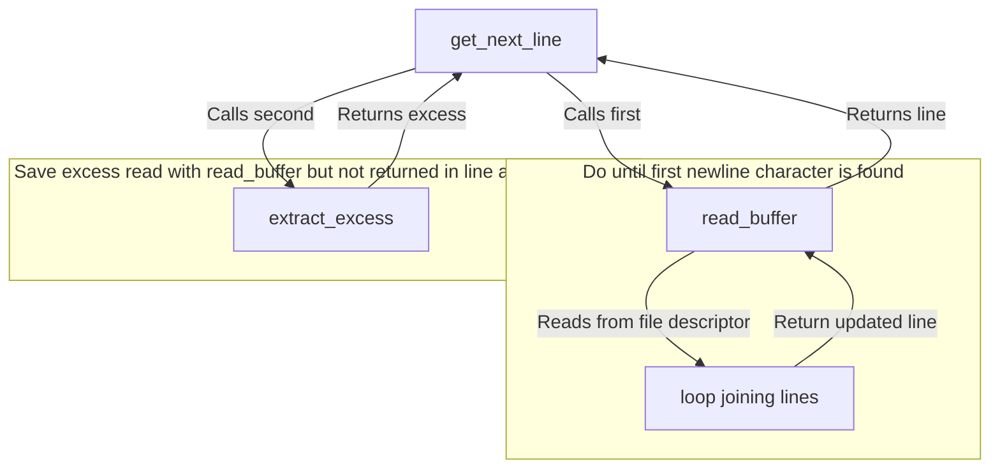

# get_next_line
Recreating the `getline` function in C to read and return lines from a file descriptor

## Diagram of information flow

```mermaid
graph TD
  A[get_next_line] -->|Calls first| B[read_buffer]
  A -->|Calls second| C[extract_excess]
  B -->|Returns line| A[get_next_line]
  C -->|Returns excess| A

  subgraph Do until first newline character is found
    B -->|Reads from file descriptor| D[loop joining lines]
    D -->|Return updated line| B
  end

  subgraph Save excess read with read_buffer but not returned in line and truncate line
    C
  end
```
