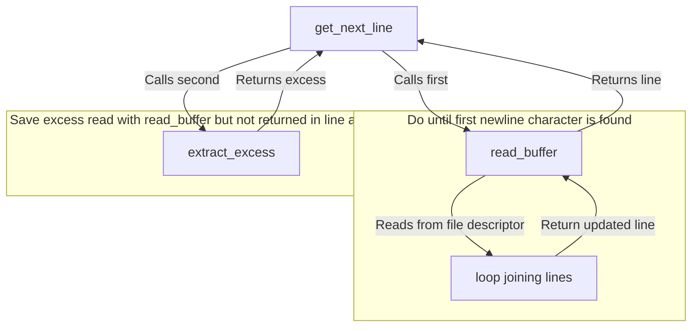

# get_next_line
Recreating the `getline` function in C to read and return lines from a file descriptor.

## Custom str_join function
For `get_next_line` a custom `str_join` function that frees the input string has been implemented.

## Diagram of information flow

## Requirements
Please refer to the [subject](./en.subject.pdf) for detailed requirements.
