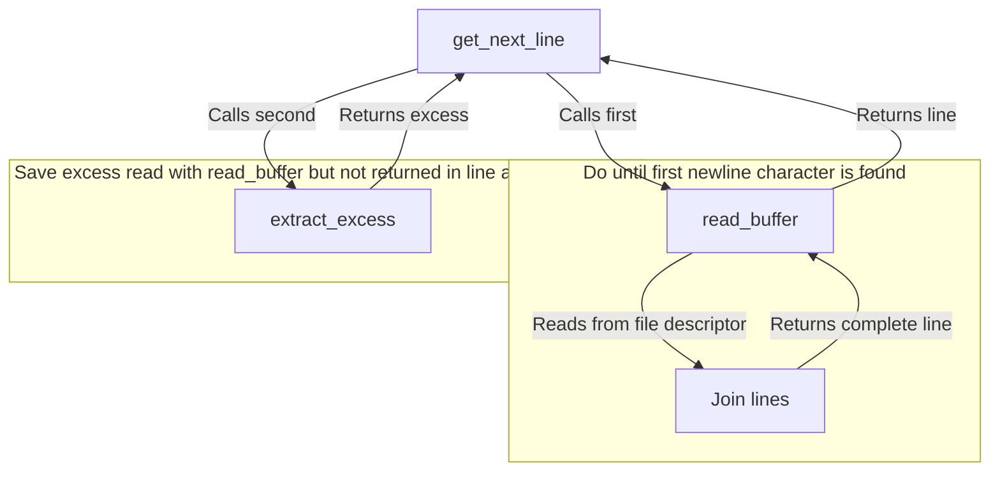

# 42-get_next_line

```mermaid
graph TD
  A[get_next_line] -->|Calls first| B[read_buffer]
  B -->|Returns line| A[get_next_line]
  A -->|Calls second| D[extract_excess]
  D -->|Returns excess| A

  subgraph Do until first newline character is found
    B -->|Reads from file descriptor| G[Join  lines]
    G -->|Returns complete line| B
  end

  subgraph Save excess read with read_buffer but not returned in line and truncate line
    D
  end
```
